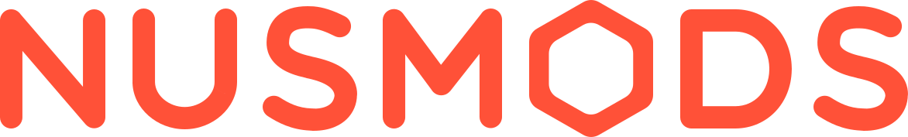
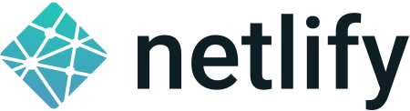

<h1>
  
</h1>

   

NUSMods is the official course catalogue, module search and timetable builder for the National University of Singapore.

## Structure

This repository contains all the code that runs NUSMods, and consists of these projects:

- [NUSMods.com website](website)
- [NUSMods Scrapers](scrapers)
- [NUSMods Timetable Export Service](export)
- [`nusmoderator` npm package](packages/nusmoderator)

## Talk to us!

We can be reached via the following methods, in order of preference.

- Telegram: https://t.me/nusmods
- Messenger: https://m.me/nusmods
- Email: nusmods@googlegroups.com (for security related issues please email mods@nusmods.com instead)
- Facebook: https://www.facebook.com/nusmods
- Twitter: https://twitter.com/nusmods

## Contributing

### Reporting Bugs

Found a bug? Before reporting it, check the [issue page](https://github.com/nusmodifications/nusmods/issues) to see if we are aware of it. If not, simply open up the [bug report form](https://github.com/nusmodifications/nusmods/issues/new?template=BUG_REPORT.md) and fill it up.

### Contributing Guide

Our [contributing guide](CONTRIBUTING.md) will help you get started, regardless of skill level. It explains the project structure and our development process.

### Good First Issues

Want to wet your feet and contribute? We have a list of [good first issues](https://github.com/nusmodifications/nusmods/labels/good%20first%20issue) that contain bugs and small features which have a relatively limited scope. This is a great place to get started.

### Code of Conduct

We have adopted Facebook's Code of Conduct that we expect project participants to adhere to. Kindly read [the full text](https://code.facebook.com/codeofconduct) to understand what actions will and will not be tolerated.

### Contributors

This project exists thanks to all the people who contributed.

### Backers

Thank you to all our backers! 🙏 [[Become a backer](https://opencollective.com/nusmods#backer)]

### Sponsors

Support this project by becoming a sponsor. Your logo/profile picture will show up here with a link to your website. [[Become a sponsor](https://opencollective.com/nusmods#sponsor)]

## License

All projects and packages in this repository are [MIT licensed](LICENSE).

## Supported by

[BrowserStack][browserstack] lets us ensure NUSMods functions across all browsers and devices by allowing us to test NUSMods on real devices, including Safari on older iPhones and previous versions of browsers.

[][browserstack]

[1Password] lets us manage our account passwords, identities and keys as a team securely and efficiently.

[Netlify](netlify) automatically deploys our branches so we can easily test incoming Pull Requests. 

[browserstack]: https://www.browserstack.com/
[1password]: https://1password.com/
[netlify]: https://www.netlify.com
