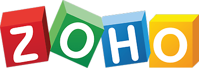

<h1>
  
</h1>

   

Help contribute to NUSMods!

## Projects

This monorepo consists of 5 projects. Further details can be found at the links below.

1. [NUSMods R website](www)
1. [NUSMods API Servers](api)
1. [NUSMods Scrapers](scrapers)
1. [NUSMods Timetable Export Service](export)
1. [`nusmoderator` npm package](packages/nusmoderator)

## Talk to us!

We can be reached via the following methods, in order of preference.

- Telegram: https://telegram.me/nusmods
- Messenger: https://www.m.me/nusmods
- Email: nusmods@googlegroups.com (for security related issues please email mods@nusmods.com instead)
- Facebook: https://www.facebook.com/nusmods
- Twitter: https://twitter.com/nusmods

## Contributing

### Code of Conduct

We have adopted the same Code of Conduct as Facebook that we expect project participants to adhere to. Please read [the full text](https://code.facebook.com/codeofconduct) so that you can understand what actions will and will not be tolerated.

### Contributing Guide

Read our [contributing guide](CONTRIBUTING.md) to learn about our development process, how to propose bug fixes and improvements, and how to build and test your changes to NUSMods.

### Good First Issues

To help you get your feet wet and get you familiar with our contribution process, we have a list of [good first issues](https://github.com/nusmodifications/nusmods/labels/good%20first%20issue) that contain bugs and small features which have a relatively limited scope. This is a great place to get started.

### Contributors

This project exists thanks to all the people who contributed. [[Contribute](CONTRIBUTING.md)].

### Backers

Thank you to all our backers! 🙏 [[Become a backer](https://opencollective.com/nusmods#backer)]

### Sponsors

Support this project by becoming a sponsor. Your logo/profile picture will show up here with a link to your website. [[Become a sponsor](https://opencollective.com/nusmods#sponsor)]

## License

All projects and packages in this repository are [MIT licensed](LICENSE).

## Supported by

[BrowserStack][browserstack] lets us ensure NUSMods functions across all browsers and devices by allowing us to test NUSMods on real devices, including Safari on older iPhones and previous versions of browsers.

[][browserstack]

[Zoho][zoho] has kindly given us individual email accounts. Zoho Mail is a secure and reliable email solution, tailor-made for an organization's communication needs. With enhanced collaboration features, it's not just an inbox… [it's more](https://www.zoho.com/workplace/).

[][zoho]

[browserstack]: https://www.browserstack.com/
[zoho]: https://www.zoho.com/
